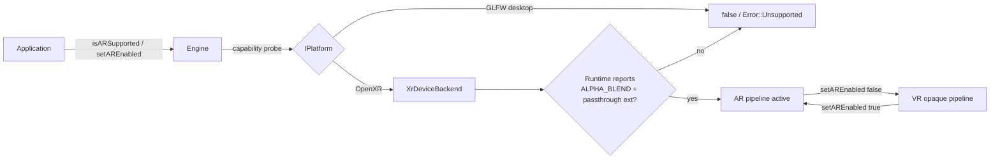
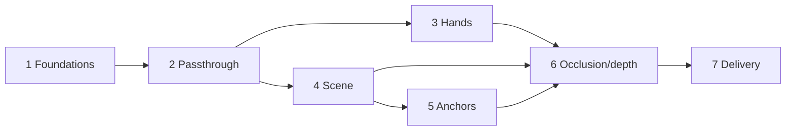

# AR / Mixed Reality Roadmap

---

## 1. What "AR" means here (terminology & reality check)

OpenXR has no "AR form factor". An AR headset is still an
`XR_FORM_FACTOR_HEAD_MOUNTED_DISPLAY` system. AR differs from VR in *how the
frame is composited by the runtime*:

| Concern | VR (today in EVAN) | AR / MR (goal) |
| --- | --- | --- |
| Environment blend mode | `XR_ENVIRONMENT_BLEND_MODE_OPAQUE` (hard-coded twice) | `XR_ENVIRONMENT_BLEND_MODE_ALPHA_BLEND` |
| What is behind the content | nothing (opaque) | real world (passthrough cameras) |
| Content alpha channel | ignored | meaningful — alpha < 1 reveals passthrough |
| Swapchain color format | any supported format | must carry alpha (`UNORM/SRGB` with alpha) |
| Render target clear | opaque background | transparent background (`alpha = 0`) |
| Extra composition layers | projection only | projection + **passthrough layer** + optional **depth layer** |
| World lock | head-locked origin | planes / meshes / spatial anchors (world-locked) |

Passthrough, hand meshes, scene meshes and depth layers are all delivered by
**OpenXR extensions** (`XR_FB_*` / `XR_KHR_*` / `XR_EXT_*`). EVAN currently uses
no extension *functions* at all, only core OpenXR + the Android instance
creation path. The single biggest missing infrastructure piece is therefore an
**extension loader + capability gate** (issue `AR-0xx`).

---

## 2. Current-state summary (what the code looks like today)

- Backend selection: exactly one platform (`BUILD_FOR_ANDROID/LINUX/WINDOWS/
  MACOS`) and exactly one backend (`BUILD_FOR_OPENXR`/`BUILD_FOR_GLFW`), enforced
  in the root `CMakeLists.txt`.
- `IPlatform` is the abstraction surface used by `Engine`. Desktop GLFW
  platforms derive from `IDesktopPlatform`; XR platforms derive from
  `IXrPlatform` (`AndroidXrPlatform`, `LinuxXrPlatform`).
- `XrDeviceBackend` owns the `XrInstance`, `XrSession`, `XrSpace`
  (STAGE, fallback LOCAL — `sources/openxr/XrDeviceBackend.cpp:506`), the frame
  wait/begin/end path and the action manager. Frame end hard-codes
  `XR_ENVIRONMENT_BLEND_MODE_OPAQUE` in **two** places
  (`preprocessFrame` skip path and `postprocessFrame`).
- `XrSwapchainContext` creates one color swapchain per eye and picks a color
  format generically (`sources/openxr/XrSwapchainContext.cpp`). It knows nothing
  about alpha requirements.
- `Renderer` clears its render pass to an opaque background; the MSAA resolve /
  framebuffer handling is not alpha-aware.
- Hand input exists only as controller/hand *actions* (poses) via
  `XrManageActions`; there is **no** `XR_EXT_hand_tracking` joint tracker and no
  hand mesh.
- `Error` taxonomy has no "feature unsupported" value.
- New sources must be listed explicitly in `cmake/Sources.cmake`
  (`EVAN_SOURCES_OPENXR`, `EVAN_SOURCES_OPENXR_ANDROID`).

---

## 3. Target design

### 3.1 Capability & state model (the "can/can't" and "on/off" API)

The engine exposes a small, stable API that any app can call safely on every
build:

```cpp
// Engine
[[nodiscard]] bool isARSupported() const;           // never true on GLFW/desktop
[[nodiscard]] bool isAREnabled() const;             // current runtime state
evan::Error setAREnabled(bool enabled);             // Error::Unsupported when AR unavailable
evan::Error isARAvailable(ARAvailability *out) const; // optional: reason if unsupported
```

- `IDesktopPlatform` (GLFW) inherits a **default** `isARSupported() == false`
  and `setAREnabled()` returning `Error::Unsupported`. No AR code is compiled
  into desktop-only builds.
- `IXrPlatform` overrides capability detection by asking the **OpenXR runtime**
  (not the OS): the runtime must report a passthrough-capable blend mode and the
  passthrough extension, otherwise `isARSupported()` is `false` even on an AR
  headset (covers "Linux OpenXR HMD that cannot do AR").
- The engine forwards the toggle to the OpenXR backend. AR state lives in the
  OpenXR layer; the engine only mirrors it.



### 3.2 Ownership rule for runtime subsystems

Every AR feature (passthrough, hand tracker, scene, anchors, depth) is a
**runtime-created subsystem** that can be *started and stopped* while the XR
session runs. Enabling AR does not rebuild the device backend or the session —
it starts subsystems and switches the blend mode. Disabling AR stops subsystems
and reverts to opaque. A subsystem must therefore own its OpenXR objects
(`XrPassthroughFB`, hand trackers, scene handles, anchor spaces) and expose
`start()/stop()/isRunning()` so the toggle path is symmetric and repeatable
across Android pause/resume.

---

## 4. Phases (single milestone)

All issues below belong to **one** GitHub milestone: *AR Ready*
(see §15). The work is delivered in seven ordered phases; each phase is a
reviewable checkpoint with its own issues, but they are **not** separate
milestones:

1. **Phase 1 · Foundations** (`AR-0xx`) — capability model, desktop gating,
   error codes, extension discovery + function loader, blend-mode plumbing,
   unit tests. *No visuals yet; fully testable without a headset.*
2. **Phase 2 · See-through passthrough** (`AR-1xx`) — passthrough layer,
   transparent compositing, correct swapchain/clear, runtime on/off; delivers
   the literal "user can enable/disable AR at runtime" requirement.
3. **Phase 3 · Hand tracking & hand occlusion** (`AR-2xx`).
4. **Phase 4 · Scene understanding & world-locked content** (`AR-3xx`) —
   planes/meshes, world-locked scene objects, hit-testing.
5. **Phase 5 · Spatial anchors** (`AR-4xx`) — create/query/persist/erase/share.
6. **Phase 6 · Real-world occlusion (depth) & MR polish** (`AR-5xx`) — depth
   submission, occlusion quality, performance, lifecycle hardening.
7. **Phase 7 · Delivery** (`AR-6xx`) — sample app, docs, CI, ABI/API review,
   release.



---

## 5. Phase 1 · Foundations (AR-0xx)

> Goal: the engine truthfully answers "is AR possible and on?" on every build,
> and OpenXR code is structured so the later milestones only add subsystems.

### AR-001 — Extend the `Error` taxonomy with "unsupported"
- Add `Error::Unsupported` (recoverable, non-fatal) to
  `headers/evan/Error.hpp`; update `isFatal`/`isRecoverable`.
- **Why:** `setAREnabled()` on desktop and `AR-0` capability probes need a
  truthful, non-crashing return code; today the closest is `RuntimeError`.
- **Accept:** `isRecoverable(Error::Unsupported) == true`;
  `isFatal(Error::Unsupported) == false`; unit tests.

### AR-002 — `IPlatform` capability surface (desktop gating, compile + API)
- Add to `IPlatform`:
  - `virtual bool isARSupported() const { return false; }`
  - `virtual Error setAREnabled(bool) { return Error::Unsupported; }`
  - `virtual bool isAREnabled() const { return false; }`
- Defaults mean **every** desktop GLFW platform (`IDesktopPlatform` and its
  Linux/macOS/Windows implementations) is automatically gated — no AR code can
  be enabled. Only `IXrPlatform` overrides.
- **Accept:** a GLFW build reports `isARSupported()==false` and
  `setAREnabled(true)` returns `Error::Unsupported` without side effects.

### AR-003 — Engine-facing AR API + desktop guard
- `headers/evan/Engine.hpp` / `sources/Engine.cpp`: implement `isARSupported`,
  `isAREnabled`, `setAREnabled` (delegating to `_platform`).
- Add explicit `_platform == nullptr` and desktop guards; never throw from the
  "unsupported" path (return `Error::Unsupported`).
- **Accept:** Engine API behaves per the table in §3.1 on both a GLFW build and
  an OpenXR build.

### AR-004 — OpenXR extension discovery & capability query
- New `headers/evan/openxr/XrExtensions.hpp` + `sources/openxr/XrExtensions.cpp`
  (list in `cmake/Sources.cmake` under `EVAN_SOURCES_OPENXR`).
- `xrEnumerateInstanceExtensionProperties` → `isExtensionSupported(instance,
  name)` helper for every extension listed in §7.
- `XrDeviceBackend`: query and cache the set of available extensions once after
  instance creation.
- **Accept:** unit-testable `isExtensionSupported` (pure, no session); logs a
  table of AR-relevant extensions at startup.

### AR-005 — Environment-blend-mode detection & selection
- After `xrGetSystemProperties`, call `xrEnumerateEnvironmentBlendModes` for the
  chosen view configuration; store supported blend modes and pick the runtime's
  preferred **opaque** mode as the default.
- **Accept:** `XrDeviceBackend` owns an `XrEnvironmentBlendMode
  _environmentBlendMode` member whose initial value equals today's opaque
  behavior; no behavior regression in VR.

### AR-006 — Replace hard-coded opaque blend with the member
- Update the **two** frame-end sites in `sources/openxr/XrDeviceBackend.cpp`
  (skip-frame path in `preprocessFrame`; `postprocessFrame`) to submit
  `_environmentBlendMode`.
- **Accept:** running VR still submits `OPAQUE`; the value is now driven by one
  place so `AR-1xx` can switch it at runtime.

### AR-007 — Extension function-pointer loader (infra for all later phases)
- `XrExtensions` gains `loadInstanceFunctions(XrInstance)` using
  `xrGetInstanceProcAddr` for every AR function the roadmap needs (passthrough,
  hand, scene, anchor, depth). Missing symbols are recorded, never crash.
- **Why:** EVAN currently calls no extension functions; passthrough/scene/anchor
  calls are all extension functions and cannot be reached without this loader.
- **Accept:** loader tolerates a runtime that lacks an extension (returns false /
  null) and every consumer checks support before calling.

### AR-008 — Per-platform instance-extension enablement
- `AndroidXrPlatform::getRequiredInstanceExtensions()` (and
  `LinuxXrPlatform`) must request the AR extension names from §7 **only when the
  build is OpenXR**. Keep the list strictly additive and never break the
  existing `XR_KHR_VULKAN_ENABLE2` / Android create-instance behavior.
- Add an `OpenXrOptions` field to opt in/out of AR extensions and to constrain
  the "minimum AR feature set", so VR apps unaffected.
- **Accept:** enabling AR extensions is configurable, additive, and a runtime
  that rejects them still boots in VR (AR simply reports unsupported).

### AR-009 — Tests for the gating logic (no hardware)
- `tests/sources/`: a "fake platform" deriving from `IPlatform` (GLFW-like)
  asserting `isARSupported()==false`, `setAREnabled(...)==Error::Unsupported`;
  a fake "AR-capable XR platform" asserting the positive path; unit tests for
  `XrExtensions` capability helpers.
- **Accept:** `ctest --output-on-failure` passes on the GLFW desktop config and
  on the OpenXR build (gtest only, no headset).

---

## 6. Phase 2 · See-through passthrough (AR-1xx) — the runtime toggle becomes real

> Goal: flipping AR on shows the real world with the scene composited over it;
> flipping off returns to opaque VR. This is the milestone that satisfies the
> stated "enable/disable at runtime" requirement.

### AR-101 — Passthrough subsystem (start/stop)
- New `XrPassthrough` (header+source, `EVAN_SOURCES_OPENXR`): creates the
  passthrough object + projection layer, `start()/stop()`, tracks running state.
- Support the Khronos `XR_KHR_composition_layer_passthrough` as primary and the
  Meta `XR_FB_passthrough` as fallback behind one small interface (or pick one
  after the AR-007 capability audit — see §7 note).
- **Accept:** object/layer created on start and destroyed on stop; idempotent.

### AR-102 — Compose the passthrough layer per frame
- In `XrDeviceBackend::postprocessFrame`, when AR is on append an
  `XrCompositionLayerPassthroughFB/KHR` *after* the projection layer; when off,
  submit projection-only (today's behavior).
- `frameEndInfo.environmentBlendMode` = `_environmentBlendMode`
  (`ALPHA_BLEND` when AR on).
- **Accept:** on-device, AR-on frame shows passthrough; AR-off frame is opaque;
  layer arrays are built/validated exactly like the existing projection layer.

### AR-103 — Alpha-capable swapchain policy + recreation on toggle
- `XrSwapchainContext`: when the active blend mode needs alpha, select a color
  format that carries alpha (from `enumerateSwapchainFormats`) instead of the
  generic first-match; otherwise keep today's choice.
- When blend mode changes at runtime, **recreate** the color swapchains (mirror
  the existing swapchain-recreate path used for out-of-date) so the format
  change takes effect.
- **Accept:** toggling AR recreates swapchains with an alpha format; VR stays on
  today's format; no device idle/fence hazards (see AR-105).

### AR-104 — Transparent background & alpha-safe resolve
- `Renderer`/render pass: when AR is on, clear to `RGBA(0,0,0,0)` and make the
  MSAA resolve + framebuffer preserve alpha (opaque clear when off).
- **Accept:** in AR, areas with no content reveal passthrough instead of an
  opaque void; switching back to VR restores the opaque clear.

### AR-105 — Frame-safe runtime toggling
- Define the safe points to apply an AR state change (before the next
  `xrWaitFrame` of a frame, with the previous frame fully submitted and device
  idle where needed). Enforce a dirty-state "apply on next safe point" so the
  toggle cannot be applied mid-frame.
- **Accept:** `setAREnabled` called at any time is applied at a safe boundary;
  repeated on/off/on cycling does not leak layers or crash.

### AR-106 — Android lifecycle: remember & restore AR preference
- On `XR_SESSION_STATE_READY` (session begin) and Android pause/resume
  (`AndroidXrPlatform`), restart/stop the passthrough subsystem to match the
  persisted AR preference and the current session state; guard against starting
  before `xrBeginSession`.
- **Accept:** AR preference survives a resume; no passthrough calls while the
  session is not running.

### AR-107 — On-device validation harness + sample toggle
- Add a debug/example path that flips AR on/off on a button or action (reuse the
  existing action system) and logs the blend mode + layer count each frame.
- Provide a manual test checklist (logcat/`adb`) to run on a Quest.
- **Accept:** documented manual test matrix: AR on, AR off, rapid toggle,
  resume-with-AR, runtime-without-passthrough (graceful unsupported).

---

## 7. Phase 3 · Hand tracking & hand occlusion (AR-2xx)

### AR-201 — Hand-joint tracking (`XR_EXT_hand_tracking`)
- `XrHandTracker` subsystem: create a tracker per hand from the session, sample
  `xrLocateHandJointsEXT` per frame at the predicted display time, expose joint
  poses (location + radius) in the LOCAL space.
- Keep it optional: when the extension or device hand tracking is unavailable,
  fall back to today's controller/hand *action* poses.
- **Accept:** joint data flows each frame while AR is on; no regression when the
  device has no hand tracking.

### AR-202 — Hand aim/grip pose parity
- Bridge joint tracking into the existing action/pose path
  (`XrHandsMotionActions`, `HandMotionEvent`) so applications see one consistent
  hand API whether driven by controllers or bare hands.
- **Accept:** existing `hand_motion_event` consumers work with bare hands.

### AR-203 — Hand occlusion meshes
- `XR_FB_hand_tracking_mesh` (or modern equivalent): fetch the hand mesh per
  frame, keep it on the GPU, and render/occlude so virtual objects correctly
  pass *behind* real hands. Coordinate with AR-5 depth strategy (mesh vs depth
  submission).
- **Accept:** with AR on, a virtual object placed at the palm is occluded by the
  real hand; with AR off the subsystem is stopped and nothing renders.

---

## 8. Phase 4 · Scene understanding & world-locked content (AR-3xx)

> Foundation for "full MR": the engine learns the room and lets the app place
> content that stays put in the real world.

### AR-301 — Scene capture subsystem (`XR_FB_scene`)
- `XrSceneUnderstanding` subsystem: create a scene handle, run scene compute,
  poll compute state, retrieve components (planes + meshes) and their locations,
  fetch mesh buffers. This is the room/plane/world data source.
- **Accept:** room planes and environment meshes become available as
  engine-agnostic data (pose, bounds, mesh) while AR is on; off on stop.

### AR-302 — World-locked reference space + coordinate bridge
- Provide a world-locked origin (LOCAL/STAGE-based) and a documented transform
  between runtime scene/anchor poses and the engine scene coordinate system
  (today scene content is head/camera-anchored with no real-world meaning).
- **Accept:** a plane returned by the runtime can be expressed in the engine's
  scene transform; math is unit-tested.

### AR-303 — Environment as engine scene content (planes/meshes + occlusion)
- Import runtime planes/environment meshes into `Scene` as renderable/occluder
  objects (reuse `addPrimitive`/mesh paths) with optional visual debug
  (wireframe planes), refreshed on scene-compute updates.
- **Accept:** app can opt to show detected planes/meshes; meshes update when the
  room changes; cleanup on AR off.

### AR-304 — Hit-testing
- Ray/plane and ray/mesh hit-testing over the detected environment, exposed to
  the app (used by anchor placement and general "tap the world" UX).
- **Accept:** hit test returns a world-locked pose + the plane/mesh hit, in the
  engine coordinate system; deterministic unit tests with synthetic planes.

---

## 9. Phase 5 · Spatial anchors (AR-4xx)

### AR-401 — Anchor creation & tracking (`XR_FB_spatial_entity`)
- Create a spatial anchor at a world-locked pose; keep its `XrSpace` updated each
  frame; expose anchor pose in the engine coordinate system.
- **Accept:** anchors stay stable across frames and headset movement.

### AR-402 — Anchor queries
- Query existing anchors in the current room/space (the `XR_FB_spatial_entity
  _query`/container surface); expose discovered anchors to the app.
- **Accept:** anchors created earlier in the same session are discoverable.

### AR-403 — Anchor persistence (and optional sharing)
- Persist/erase anchors (uuid → storage) and load persisted anchors across app
  launches. Sharing (`XR_FB_spatial_entity_sharing` / colocation) is
  explicitly a follow-up — track separately, do not block AR-1..AR-3.
- **Accept:** an anchor persisted in session A is found by a query in session B.

---

## 10. Phase 6 · Real-world occlusion (depth) & polish (AR-5xx)

### AR-501 — Depth submission for correct occlusion
- Compose a depth layer with the rendered scene depth so the runtime occludes
  scene content *behind* real geometry correctly (beyond AR-303 mesh occluders):
  attach a depth swapchain and submit `XrCompositionLayerDepth*` alongside
  projection + passthrough when AR is on.
- **Accept:** virtual objects intersect real furniture correctly from any angle;
  disabling AR removes the depth layer.

### AR-502 — Occlusion quality & performance tuning
- Depth/precision, near-plane behavior at arm's length, per-frame cost budget,
  GPU memory for extra depth + hand + scene meshes, frame timing vs
  `predictedDisplayTime`.
- **Accept:** documented frame-time budget on Quest; no new frame stalls;
  profiles show bounded overhead.

### AR-503 — Lifecycle & robustness pass
- Exhaustive matrix: session loss mid-AR, instance-loss while AR on, app
  background/foreground, extension suddenly unavailable, swapchain out-of-date
  *while* AR on, toggling AR during a scene-compute update.
- Fix any leaked handles; ensure `isAREnabled()` never lies after a session
  restart.
- **Accept:** no leaks across 1000+ toggle cycles in a soak test on device.

---

## 11. Phase 7 · Delivery (AR-6xx)

### AR-601 — Public API & docs review
- Finalize `isARSupported/isAREnabled/setAREnabled` semantics, add
  `EVAN`-style Doxygen docs on every new public symbol and the new headers, and
  update `docs/ARCHITECTURE.md` + `docs/HOW_EVAN_WORKS.md`.
- **Accept:** a reviewer new to the code can enable/disable AR from the docs
  alone.

### AR-602 — Sample & CI
- Sample app (or documented example) demonstrating the AR toggle and world-locked
  placement; CI OpenXR/Android build job compiles the new `EVAN_SOURCES_OPENXR`
  / `EVAN_SOURCES_OPENXR_ANDROID` additions; GLFW job stays green and asserts the
  desktop gate in a gtest.
- **Accept:** CI green on GLFW desktop + OpenXR (Android) matrix;
  `./scripts/run-clang-format.sh` clean.

### AR-603 — ABI/API & release notes
- Confirm new public symbols don't break the existing class layout rules, bump
  version/CHANGELOG, and record the minimum Meta/OpenXR runtime version that was
  validated (§7 note).

---

## 12. Master step list (dependency-ordered)

Use this as the canonical ordering when cutting the work; each line is a commit
or issue and nothing downstream is attempted before its inputs.

1. `Error::Unsupported` (+ taxonomy tests).
2. `IPlatform` capability defaults → desktop GLFW gate is automatic.
3. Engine `isARSupported/isAREnabled/setAREnabled` + desktop guard.
4. OpenXR extension discovery helper (`XrExtensions`, capability query).
5. Environment blend-mode enumeration/selection in `XrDeviceBackend`.
6. Blend-mode member replaces the two hard-coded `OPAQUE` sites.
7. Extension function-pointer loader.
8. Per-platform AR instance-extension enablement (`OpenXrOptions`, Android/Linux).
9. Gating unit tests (fake GLFW + fake AR-capable XR platform).
10. Passthrough subsystem create/start/stop.
11. Per-frame passthrough layer + dynamic blend (visual on/off).
12. Alpha-capable swapchain policy + recreation on toggle.
13. Transparent clear + alpha-safe resolve.
14. Frame-safe toggle application point.
15. Android lifecycle restore + on-device manual matrix.
16. Hand-joint tracker subsystem.
17. Hand pose bridge into existing actions/events.
18. Hand occlusion meshes.
19. Scene capture subsystem (planes/meshes + locations).
20. World-locked reference space + engine coordinate bridge.
21. Environment meshes/planes as scene content + debug view.
22. Hit-testing.
23. Spatial anchor create/track.
24. Anchor query.
25. Anchor persistence (+ sharing as follow-up).
26. Depth submission layer (correct real-world occlusion).
27. Quality/perf tuning.
28. Lifecycle/robustness soak.
29. Docs, sample, CI, formatting, changelog.

---

## 13. Extension checklist for Meta Quest (verify at AR-004)

Enable **only after** capability check; a runtime lacking one must still boot in
VR and report AR unsupported:

| Purpose | Extension (primary / fallback) |
| --- | --- |
| Passthrough layer | `XR_KHR_composition_layer_passthrough` (preferred) / `XR_FB_passthrough` |
| Hand joints | `XR_EXT_hand_tracking` |
| Hand mesh occlusion | `XR_FB_hand_tracking_mesh` (or depth-based path in AR-5) |
| Scene/room understanding | `XR_FB_scene` (Meta) — modern `XR_META_*` variants as they stabilize |
| Spatial anchors | `XR_FB_spatial_entity`, `XR_FB_spatial_entity_query`, `XR_FB_spatial_entity_storage` |
| Depth submission | `XR_FB_composition_layer_depth` / `XR_KHR_composition_layer_depth` |

> **Platform note / risk:** exact struct/function names and the minimum Meta
> runtime version must be confirmed against the OpenXR headers actually linked in
> this repo and one on-device run early in AR-1. Do this *before* AR-101 so the
> passthrough interface targets the right extension family. Scene/anchor
> features also require runtime user-permission flows (scene data / spatial data)
> that can only be validated on device — schedule that in AR-3/AR-4, not in CI.

---

## 14. Explicitly out of scope (track separately)

- Cross-device / colocated shared anchors & scene sharing (`AR-403` follow-up).
- Passthrough color grading (e.g. LUT), camera intrinsics export.
- Desktop "AR" of any kind (webcam/mock passthrough) — the product rule is that
  AR is only ever real on an AR-capable XR runtime, never synthesized on a GLFW
  desktop build.

---

## 15. Milestone — AR Ready (single epic)

> Copy-paste ready. All work is tracked under **one** GitHub milestone
> ("AR Ready"); each item below is an issue filed in that
> milestone. Issues live in [`docs/ar-issues/`](ar-issues/) — one markdown file
> per issue, named `AR-###-slug.md`.

### Milestone description

**Title:** AR Ready

**Description**

> Add full AR / mixed-reality support to EVAN on OpenXR (target: Meta Quest /
> Android) so applications can run opaque VR and real-world AR from the same
> engine and **toggle between them at runtime**.
>
> The work ships in seven ordered phases inside this single milestone:
>
> 1. **Foundations** — how EVAN answers "is AR possible?" and "is AR on?" on
>    every build, plus the OpenXR extension/capability plumbing every later
>    phase needs.
> 2. **See-through passthrough** — the visible runtime toggle: passthrough
>    compositing, dynamic environment blend mode, alpha-correct rendering and
>    swapchains, lifecycle-safe on/off.
> 3. **Hand tracking & occlusion** — bare-hand joints and hand occlusion meshes.
> 4. **Scene understanding & world-locked content** — room planes/meshes,
>    world-locked content and hit-testing.
> 5. **Spatial anchors** — create/query/persist anchors across launches.
> 6. **Real-world occlusion (depth) & polish** — depth-submission occlusion,
>    quality/perf tuning, robustness soak.
> 7. **Delivery** — public API & docs, sample, CI, formatting, release notes.
>
> **Hard constraint (non-negotiable):** AR must **never be enableable on desktop
> builds**. Any `BUILD_FOR_GLFW` configuration must report AR unsupported and
> return `Error::Unsupported` from `setAREnabled(...)` with no side effects. On
> non-Android desktop-only operating systems no AR entry point is exposed at
> all.
>
> **Definition of done (milestone-wide):**
> - A GLFW/desktop build truthfully reports `isARSupported() == false` and
>   refuses `setAREnabled(true)`.
> - An AR-capable OpenXR runtime lets the app switch opaque VR ⇄ see-through AR
>   at runtime, repeatedly, without leaks or crashes; disabling AR restores
>   today's opaque VR path bit-for-bit.
> - Passthrough, hand tracking, scene understanding and anchors each start/stop
>   cleanly with the AR toggle and survive Android pause/resume and session
>   loss.
> - Virtual content is world-locked and occluded correctly by real hands and
>   furniture.
> - Unit tests cover the gating logic with no headset; CI is green on the GLFW
>   desktop and OpenXR (Android) matrix; formatting clean; docs updated.

---

## 16. Issue index

| Issue | File | Phase |
| --- | --- | --- |
| AR-001 | `docs/ar-issues/AR-001-error-unsupported.md` | Foundations |
| AR-002 | `docs/ar-issues/AR-002-ipatform-capability-surface.md` | Foundations |
| AR-003 | `docs/ar-issues/AR-003-engine-ar-api.md` | Foundations |
| AR-004 | `docs/ar-issues/AR-004-openxr-extension-discovery.md` | Foundations |
| AR-005 | `docs/ar-issues/AR-005-environment-blend-mode-detection.md` | Foundations |
| AR-006 | `docs/ar-issues/AR-006-dynamic-blend-mode-plumbing.md` | Foundations |
| AR-007 | `docs/ar-issues/AR-007-extension-function-loader.md` | Foundations |
| AR-008 | `docs/ar-issues/AR-008-per-platform-extension-enablement.md` | Foundations |
| AR-009 | `docs/ar-issues/AR-009-gating-logic-tests.md` | Foundations |
| AR-101 | `docs/ar-issues/AR-101-passthrough-subsystem.md` | See-through passthrough |
| AR-102 | `docs/ar-issues/AR-102-passthrough-frame-composition.md` | See-through passthrough |
| AR-103 | `docs/ar-issues/AR-103-alpha-swapchain-policy.md` | See-through passthrough |
| AR-104 | `docs/ar-issues/AR-104-transparent-background.md` | See-through passthrough |
| AR-105 | `docs/ar-issues/AR-105-frame-safe-toggle.md` | See-through passthrough |
| AR-106 | `docs/ar-issues/AR-106-android-lifecycle-restore.md` | See-through passthrough |
| AR-107 | `docs/ar-issues/AR-107-on-device-validation.md` | See-through passthrough |
| AR-201 | `docs/ar-issues/AR-201-hand-joint-tracking.md` | Hand tracking & occlusion |
| AR-202 | `docs/ar-issues/AR-202-hand-pose-parity.md` | Hand tracking & occlusion |
| AR-203 | `docs/ar-issues/AR-203-hand-occlusion-meshes.md` | Hand tracking & occlusion |
| AR-301 | `docs/ar-issues/AR-301-scene-capture-subsystem.md` | Scene understanding |
| AR-302 | `docs/ar-issues/AR-302-world-locked-reference-space.md` | Scene understanding |
| AR-303 | `docs/ar-issues/AR-303-environment-as-scene-content.md` | Scene understanding |
| AR-304 | `docs/ar-issues/AR-304-hit-testing.md` | Scene understanding |
| AR-401 | `docs/ar-issues/AR-401-anchor-creation-tracking.md` | Spatial anchors |
| AR-402 | `docs/ar-issues/AR-402-anchor-query.md` | Spatial anchors |
| AR-403 | `docs/ar-issues/AR-403-anchor-persistence.md` | Spatial anchors |
| AR-501 | `docs/ar-issues/AR-501-depth-submission.md` | Occlusion (depth) & polish |
| AR-502 | `docs/ar-issues/AR-502-occlusion-quality-tuning.md` | Occlusion (depth) & polish |
| AR-503 | `docs/ar-issues/AR-503-lifecycle-robustness.md` | Occlusion (depth) & polish |
| AR-601 | `docs/ar-issues/AR-601-public-api-docs-review.md` | Delivery |
| AR-602 | `docs/ar-issues/AR-602-sample-and-ci.md` | Delivery |
| AR-603 | `docs/ar-issues/AR-603-abi-release-notes.md` | Delivery |
